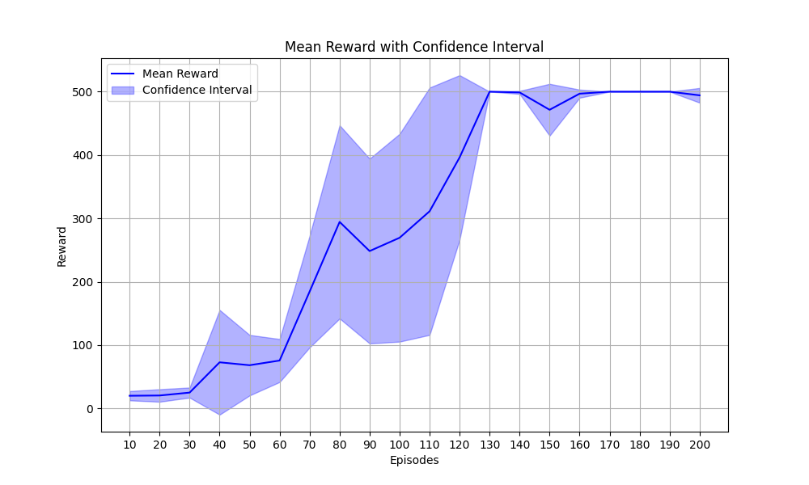

# PPO and GRPO Agents

This is a personal and experimental (for fun 😊)repository implements Proximal Policy Optimization (PPO) to train an agent on CartPole-v1 using PyTorch and Gymnasium. 

📊 Recap 
The main differences between PPO and GRPO GRPO used the KL divergence regularization instead of clipping in PPO. This results in more stable updates and controls the policy shifts. **GRPO** tends to be **more stable**, but may learn **more slowly** compared to PPO due to stricter constraints.

### **PPO (Proximal Policy Optimization)**
Optimizes the objective with **clipping** to restrict large updates:

```math
J_{\text{PPO}}(\theta) = \mathbb{E}_t \left[ \min \left( r_t(\theta) A_t, \text{clip} (r_t(\theta), 1 - \epsilon, 1 + \epsilon) A_t \right) \right] 
```

### **GRPO (Generalized Reinforcement Policy Optimization)**
```math
J_{\text{GRPO}}(\theta) = \mathbb{E}_t \left[ r_t(\theta) A_t - \beta D_{\text{KL}}(\pi_{\theta} || \pi_{\theta_{\text{old}}}) \right] 
```


📊Training Insights

The mean reward plot shows rapid learning, reaching near-optimal performance (500 reward) within ~100 episodes.
The confidence interval plot (below) highlights the reward variance across the 5 training runs of 200 episodes.




🚀How to Run

Install dependencies:

`pip install -r requirements.txt`

Train the PPO agent:

`python agents.py`

Generate and visualize results:

`python plot.py`


